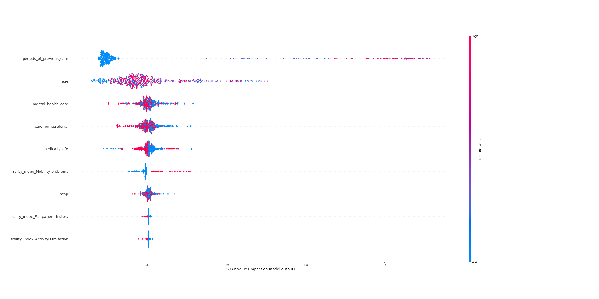

# Shapley Values Python
A repository to show examples of Shapley Values in Python.

To follow along with this, not mandatory, but use the environment.yaml to replicate my conda environment. 

# Installation Instructions

Install the [Anaconda distribution](https://www.anaconda.com/products/individual), then open *Anaconda prompt*.

## Using environment.yaml

1. Download the [environment.yaml](https://github.com/StatsGary/ShapleyValuesPython/blob/main/scikitlearnenv.yml) for the tutorials.

2. In *Anaconda prompt*, navigate to the directory containing the *environment.yaml* and write `conda env create -f scikitlearnenv.yaml`.

3. Activate the new environment with `conda activate ml`.

## Using requirements.txt

[See here](https://towardsdatascience.com/how-to-setup-python-for-machine-learning-173cb25f0206?sk=8e25eb341c8910209ff683071650c180) for more detailed guide of steps 1-2, 5-7.

1. Create a new Python environment with `conda create -n ml python=3.8.5 anaconda`.

2. Activate the new environment with `conda activate ml`.

3. Navigate to directory containing the *requirements.txt* of this repository ([here](https://github.com/jamescalam/transformers/blob/main/requirements.txt)).

4. Write `pip install -r requirements.txt`.

5. Move onto the **Installation of PyTorch** section.

